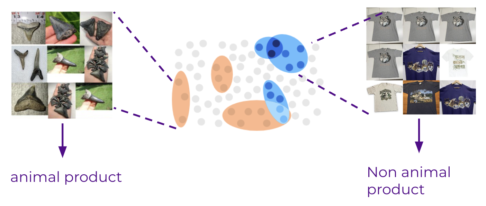

# NYU-bigdata-final-project
NYU Big Data Final Project 

CS-GY 6513 Big Data (Section C)

Group Members:

Suemy Inagaki (si2324)
Tianxiao He (th3129)
Revin Dsilva (rd3387)

Group Name: WildData Trio

Project Title: WildLife: Exploring Wildlife Trafficking through Animal-Related Ads

Wildlife trafficking poses a severe threat to global biodiversity and ecological balance. Detecting wildlife trafficking online is crucial due to the scale and anonymity it provides to traffickers. Thus, we aim to identify and categorize products derived from animals, particularly in online environments where such transactions occur. However, the absence of clean and labeled data poses a significant obstacle. In this project, we first cluster the raw dataset using BERTopic with unlabeled data. Then, we perform an exploratory analysis of the BERTopic output and generate pseudo labels using weakly supervised learning. Finally, we use the data labeled in the previous step to train a classifier

For running the code with full dataset, please refer to https://vida-jupyterhub.hsrn.nyu.edu/user/teammate2

